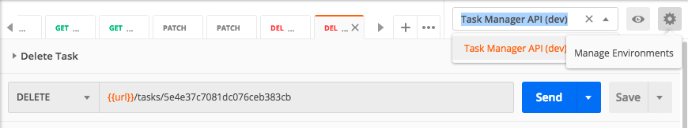

# APIs

## RESTful API (Representational State Transfer - Application Programming Interface)

The REST API allows client such as web application to access and manipulate resources using a set of predefined operations.

Reprsentational - working with representations of the data stored in database

State Transfer - the state has been transfer from the server to the client

* [Course code](task-manager/)

* HTTP methonds and CRUD operations

  * Create - POST
  * Read - GET
  * Update - PATCH
  * Delete - DELETE

* The structure of a HTTP request is text-based.
    1. Request line **HTTP method, /path, HTTP protocal**
    2. Headers (Accept, Connection, Auth...)
    3. Provided data

* HTTP Response
    1. Statue line **HTTP protocal, Status code, Text representation of the status code**
    2. Headers

* Use [Postman](https://www.postman.com/) for API testing

  * Set up env var
    

  * Set up auth for whole collection
    1. Choose 'Edit' from the Collection options
    2. Authorization -> Bearer Token -> Update

  * Set up auth from automatic JS script
    1. Set Collection/Edit/Authorization/Bearer Token to {{authToken}}
    2. Add test script in the request (e.g. login and create requests)

            //pm = postman
            if (pm.response.code === 201) {
                pm.environment.set('authToken', pm.response.json().token);
            }
            //This will automatically update the env variable called authToken once the request is sent.

* [HTTP status code](https://httpstatuses.com/)
  * 200 - OK
  * 201 - created
  * 400 - bad request
  * 404 - not found
  * 500 - internal server error

* Seperate route files
  * It's typically best to break a long route file (index.js) into some small route files.
  * index.js

            const userRouter = require('./routers/user');

            app.use(taskRouter);

  * src/routers/user.js

            const express = require('express');
            const router = new express.Router(); //create new router
            const User = require('../models/user');

            //move all http methods to the file and change app to router
            router.post('/users', async(req, res) => {
                //...
            });

            module.exports = router;

  * remove unused lines from index.js

            //for example
            const User = require('../models/user');
