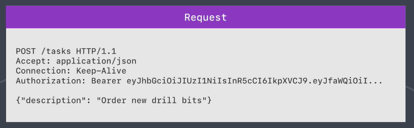
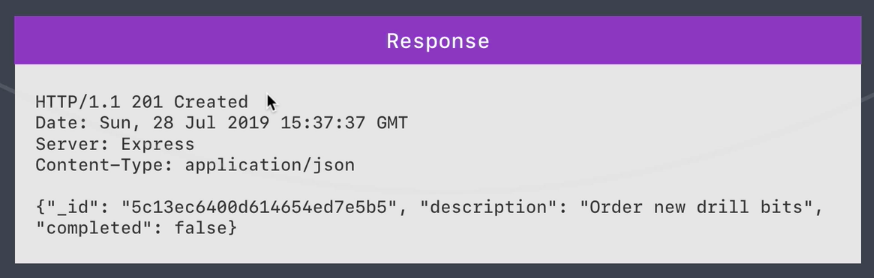

# RESTful API (Representational State Transfer - Application Programming Interface)

The REST API allows client such as web application to access and manipulate resources using a set of predefined operations.

Reprsentational - working with representations of the data stored in database

State Transfer - the state has been transfer from the server to the client

* [Course code](task-manager/)

* HTTP methonds and CRUD operations
    * Create - POST
    * Read - GET
    * Update - PATCH
    * Delete - DELETE

* The structure of a HTTP request is text-based.
    1. Request line **HTTP method, /path, HTTP protocal**
    2. Headers (Accept, Connection, Auth...)
    3. Provided data
    

* HTTP Response
    1. Statue line **HTTP protocal, Status code, Text representation of the status code**
    2. Headers

* Use [Postman](https://www.postman.com/) for API testing

* Check [HTTP status code](https://httpstatuses.com/)
