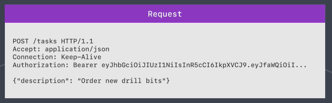
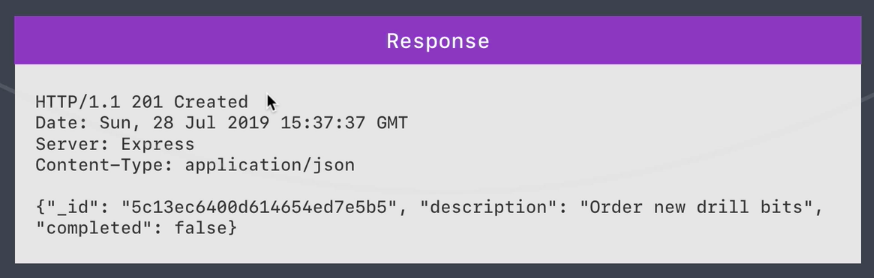

# Note

### Cores
* Node.js
* NPM, Node.js Package Manager
* Nodemon
* Express
* MongoDB
* Angular

### Basic Concepts
* [JSON](playground/1-json.js)
* Arror function [1](playground/2-arror-function.js) [2](playground/3-arror-challenge.js)
* [Callback](playground/callack.js)
* [ES6 objects](playground/es6-object.js)
* [Raw HTTP](playground/raw-http.js)
* [Default parameter](playground/default-param.js)
* [Promises](playground/8-promises.js)

### Before you start...
* Install NPM, NodeJS Package Manager
    * Use npm to install NodeJS modules

            npm init -y

### app.js
* Require needed packages

        // Require needed packages
        const yargs = require('yargs');
        const notes = require('./notes.js');

* Parsing arguments
1. process

        const address = process.argv[2];

2. yargs

        //customize yargs version
        yargs.version('1.1.0');

        //create commands (try node app.js --help)
        yargs.command({
            command: 'add',
            describe: 'Add a new note',
            builder: {
                title: {
                    describe: 'Note title',
                    demandOption: true, //default: false
                    type: 'string' //default: boolean
                },
                body: {
                    describe: 'Note content',
                    demandOption: true,
                    type: 'string'
                }
            },
            handler(argv) {
                notes.addNote(argv.title, argv.body);
            }
        });

        yargs.parse();

* Express web framework

        const express = require('express');

        // Create an Express application
        const app = express();

        // We can send back string, html and JSON
        app.get('', (req, res) => {
            res.send('<h1>Express</h1>');
        });

        // Express will automatically convert object to JSON
        app.get('/help', (req, res) => {
            res.send([{
                name: 'Andrew',
                age: 18
            }, {
                name: 'Tom'
            }]);
        });

        // Start the server
        // Access the app in browser by http://localhost:3000/
        app.listen(3000, () => {
            console.log('Server is up on port 3000.');
        });

### utils.js
* Export functions

        module.exports = add;
        module.exports = {
            getNotes: getNotes,
            addNote: addNote
        };

* Make HTTP request

        const request = require('request');
        const url = '...';
        request({ url: url }, (error, response) => {
            const data = JSON.parse(response.body);
            console.log(data.);
        });

### [MongoDB](https://docs.mongodb.com/)
* SQL v.s NoSQL terms

        +------------+------------+
        | Table      | Collection |
        +------------+------------+
        | Row/Record | Document   |
        +------------+------------+
        | Column     | Field      |
        +------------+------------+

* Start MongoDB

        mongodb/bin/mongod --dbpath=... --port=...

* [MongoDB GUI Viewer - Robo 3T](https://robomongo.org/download): Use JavaScript to manipulate MongoDB data

        db.version()

* Install [mongodb module](https://mongodb.github.io/node-mongodb-native/2.0/api/index.html) for Node.js

        npm i mongodb

#### CRUD operations (mongodb.js)

        const mongodb = require('mongodb');
            const MongoClient = mongodb.MongoClient;

            const connectionURL = 'mongodb://127.0.0.1:27018';
            const databaseName = 'task-manager';

            MongoClient.connect(connectionURL, {useNewUrlParser: true}, (error, client) => {
                if (error) {
                    return console.log('Unable to connect to database!');
                }

                //MongoDB will create the db if not exists
                const db = client.db(databaseName); 

                //CRUD operations...
        });

* [insertOne](https://mongodb.github.io/node-mongodb-native/2.0/api/Collection.html#insertOne) and insertMany

        db.collection('users').insertOne({
            name: 'Lily',
            age: 13
        });

        db.collection('users').insertMany([
            {
                name: 'Jane',
                age: 28
            }, {
                name: 'Ross',
                age: 27
            }
        ], (error, result) => {
            if (error) {
                return console.log('Unable to insert documents!');
            }
            console.log(result.ops);
        });

* ObjectID

        //import ObjectID from mongodb module
        const {MongoClient, ObjectID} = require('mongodb');

        //generate a new ID
        const id = new ObjectID();
        console.log(id);
        console.log(id.getTimestamp());

* findOne and find

        db.collection('tasks').findOne({_id: new ObjectID('5e4bb3d487b1226d59221fdd')}, (error, result) => {
            console.log(result);
        });

        //find returns a cursor
        db.collection('users').find({name: 'Lily'}).toArray((error, result) => {
            console.log(result);
        });

        //replace toArray with count to get the length
        db.collection('users').find({name: 'Lily'}).count((error, result) => {
            console.log(result);
        });

* [updateOne and updateMany](https://docs.mongodb.com/manual/reference/operator/update/)
        
        //updateOne returns a promise if no callback passed
        db.collection('users').updateOne({
            _id: new ObjectID('5e4942f6e5b9e0531775390b')
        }, {
            $inc: { //MongoDB update operator
                age: -5
            }
        }).then((result) => {
            console.log(result);
        }).catch((error) => {
            console.log(error);
        });

        db.collection('tasks').updateMany({
            completed: true
        }, {
            $set: {
                completed: false
            }
        }).then((result) => {
            console.log(result.modifiedCount);
        }).catch((error) => {
            console.log(error);
        });

* [deleteOne and deleteMany]()

        db.collection('users').deleteOne({
            name: 'Lily'
        }).then((result) => {
            console.log(result);
        }).catch((error) => {
            console.log(error);
        });

        db.collection('users').deleteMany({
            age: 30
        }).then((result) => {
            console.log(result);
        }).catch((error) => {
            console.log(error);
        });

### [Mongoose](https://mongoosejs.com/)

        //mongoose uses mongodb module
        const mongoose = require('mongoose');

        //provide the db name as part of the connection URL
        mongoose.connect('mongodb://127.0.0.1:27018/task-manager-api', {
            useNewUrlParser: true,
            useCreateIndex: true
        });

        //create and User model
        // {'name for your model', {definition}}
        // Mongoose provides a basic type validation
        const User = mongoose.model('User', {
            name: {
                type: String
            },
            age: {
                type: Number
            }
        });

        //model instance
        const me = new User({
            name: 'Andrew Ng', 
            age: 27
        });

        //save the instance to the db (return a promise)
        me.save().then(() => {
            console.log(me);
        }).catch((error) => {
            console.log('Error!', error);
        });

#### [Data validation and sanitization](https://mongoosejs.com/docs/schematypes.html)

        const User = mongoose.model('User', {
            name: {
                type: String,
                required: true,
                trim: true
            },
            age: {
                type: Number,
                default: 0,
                //custom validator for a field
                validate(value) { //value -> the input of age
                    if (value < 0) {
                        throw new Error('Age must be a postive number!');
                    }
                }
            },
            email: {
                type: String,
                required: true,
                trim: true,
                lowercase: true,
                validate(value) {
                    //use validator module
                    if (!validator.isEmail(value)) {
                        throw new Error('Email is invalid.');
                    }
                }
            },
            password: {
                type: String,
                required: true,
                minlength: 7,
                trim: true,
                validate(value) {
                    if (value.toLowerCase().includes('password')) {
                        throw new Error('Do not use "password" in password.');
                    }
                }
            }
        });

### RESTful API (Representational State Transfer - Application Programming Interface)

The REST API allows client such as web application to access and manipulate resources using a set of predefined operations.

Reprsentational - working with representations of the data stored in database

State Transfer - the state has been transfer from the server to the client

* HTTP methonds and CRUD operations
    * Create - POST
    * Read - GET
    * Update - PATCH
    * Delete - DELETE

* The structure of a HTTP request is text-based.
    1. Request line **HTTP method, /path, HTTP protocal**
    2. Headers (Accept, Connection, Auth...)
    3. Provided data
    

* HTTP Response
    1. Statue line **HTTP protocal, Status code, Text representation of the status code**
    2. Headers

* Use [Postman](https://www.postman.com/) for API testing

